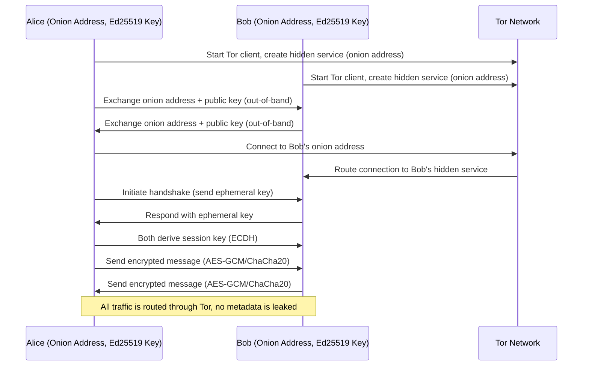

# Architecture — cwtch-java-protocol

## Overview
This document describes the architecture and design of the Cwtch-style decentralized messaging protocol implemented in this library.

### Key Components
- **Identity**: Ed25519/X25519 key pair for each user
- **Tor Integration**: Each client runs a Tor hidden service (onion address)
- **Handshake**: ECDH key exchange for session key negotiation
- **Messaging**: All messages encrypted with session key (AES-GCM/ChaCha20)
- **Group Chat**: Group key management and secure distribution

## Protocol Flow

## Security Model
- No central server or directory
- Onion addresses and keys exchanged out-of-band
- All traffic routed through Tor for anonymity
- Forward secrecy via ephemeral session keys
- No cleartext metadata (usernames, contact lists, etc.)

---

See [api.md](api.md) for class-level documentation and [diagrams.md](diagrams.md) for more protocol flows.
